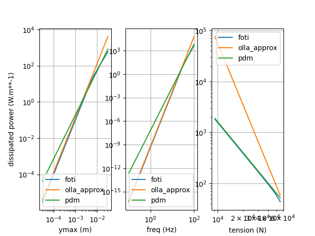
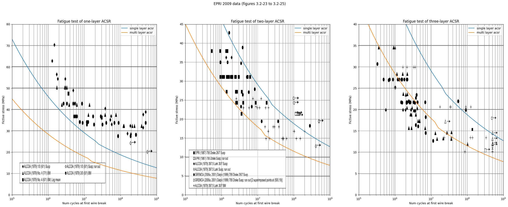

Damping power
================
This example can be reproduced by executing the script called 'damping_power.py' located in the
examples folder.

The script executes different damping power methods and plots the output as function of (ymax,
freq, tension)

Safe border line
=================
This example can be reproduced by executing the script called 'safe_border_line.py' located in the
examples folder.

The script calculates the safe border line for single and multi layer acsr conductors.

This figure shows a comparison between fatigue tests done in laboratory and the sbl method :

